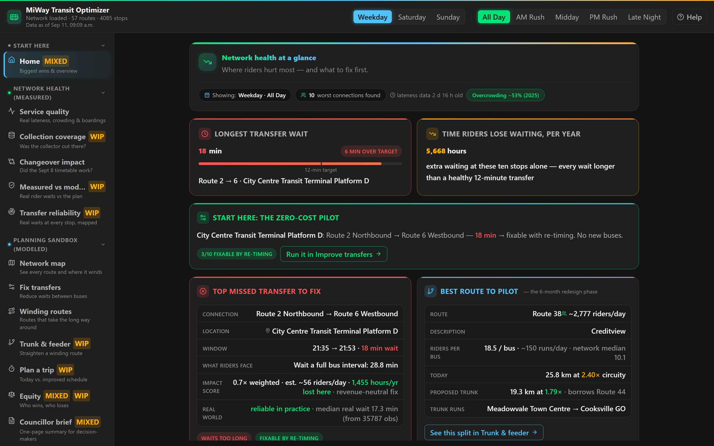
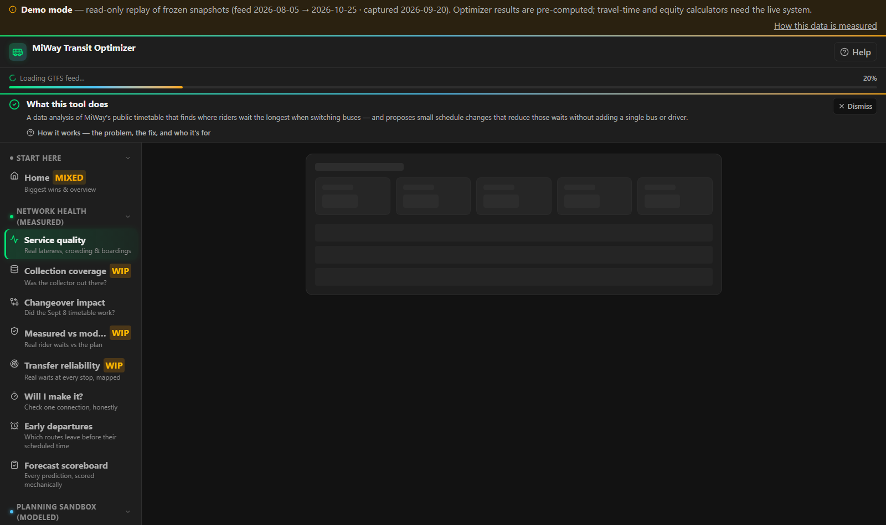
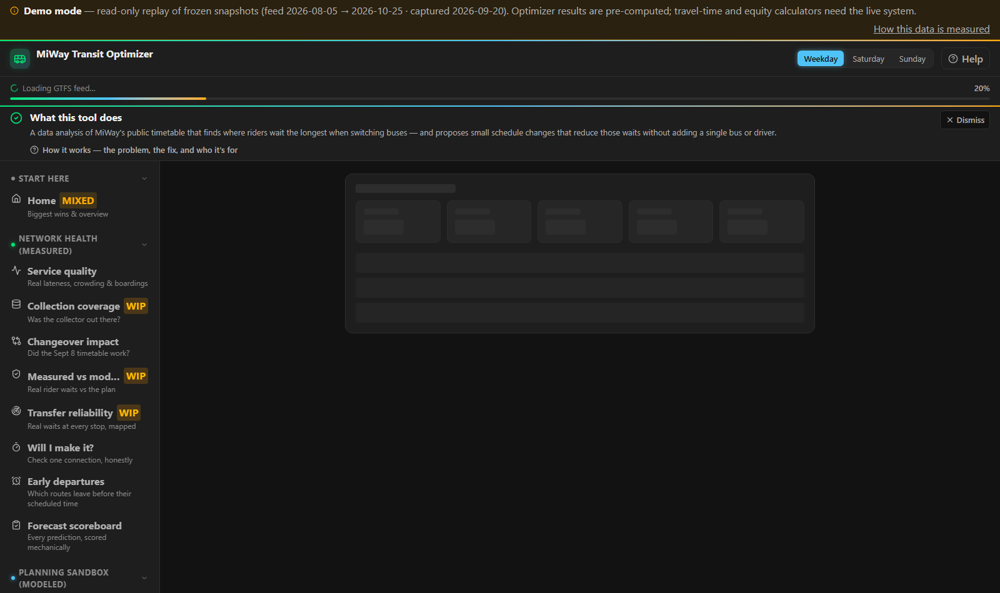
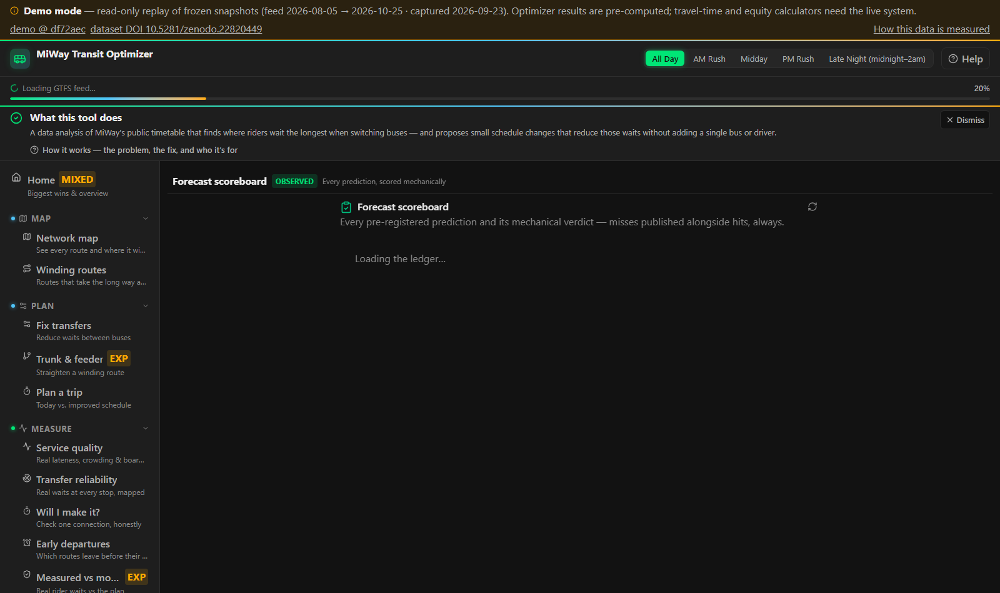

# MiWay Findings — an independent measurement of Mississauga's bus network

An independent, student-run measurement project. Built summer 2026, running 24/7 since.

**The question:** MiWay publishes a timetable and a real-time feed. How well does the actual service match what riders are promised — and what would a small, data-driven re-timing buy them?

**The instrument:** a full-stack analytics platform (Python/FastAPI/React) that polls the GTFS + GTFS-RT feeds every 30 seconds, around the clock, on a cloud VPS I administer. As of September 2026 it has logged **66,000+ polls at 99.0% success** and captured **4.0M+ unique scheduled bus departures** for measurement.

---

## What the dashboard looks like

Every finding renders as an interactive view (FastAPI + React, deep-linkable by URL). A few frames, captured live from the running system:

> 🖥️ **[Try the interactive demo](demo/) — no install, no backend.** The full dashboard frontend replaying frozen API snapshots, captured from the live system. It adapts to phone screens (hamburger navigation, stacked cards, scrollable tables), so it reads as well in a councillor's palm as on a desktop. Every view is guarded by a per-panel error boundary: a failure in one analysis never takes the rest of the dashboard down.

---

## What the data shows

Weekly, immutable findings snapshots (each frozen, never edited after freezing):

- [Week of Aug 17–23](docs/findings-v1-n7-aug17-23.md)
- [Week of Aug 24–30](docs/findings-v2-n7-aug24-30.md)
- [Week of Aug 31–Sep 6](docs/findings-v3-n7-aug31-sep06.md)
- [Week of Sep 7–13](docs/findings/findings-v4-post-sept7.md)

Recurring findings, stated conservatively:

1. **Early departures.** A large share of recorded departures leave more than two minutes ahead of schedule — and an early bus is a missed bus for anyone following the timetable.
2. **Ghost trips.** A measurable fraction of scheduled trips never appear in the real-time feed at all — for whatever operational reason (breakdown, pull-from-service, gap in the feed), riders waited at a stop for a bus that never came, invisibly. My first published estimate of this rate (1 in 32) was **wrong**; see *The correction* below.
3. **Night crowding.** Some late-evening corridors run their worst decile at or over seated capacity — a rider-safety issue that hides outside rush hour.
4. **Sensor honesty.** MiWay's automatic passenger counters (APCs) report loads in bands far wider than advertised — I characterized the hysteresis from 4.9M+ APC load observations after 399 on-board check-ins across 14 routes showed two different passenger counts reporting identically.
5. **An equity trap.** The network-level "optimized" schedule quietly makes some wards worse. My own optimizer did this to Ward 9 (+2.56 min/stop) — so I shipped a per-stop guardrail that catches it.

## What a re-timing could buy

The centerpiece is a constraint optimizer (OR-Tools CP-SAT, ~900 lines — [solver_core.py](solver_core.py)) that re-times the network (±5 min/route) under real fleet and layover constraints:

| Measure | Today | After re-timing |
|---|---|---|
| Avg transfer wait (weighted) | 18.84 min | 16.82 min |
| Missed connections | 2,789 | 2,456 |
| Rider waiting | 90,827 pax-min | 81,089 pax-min (**~9,700/day saved**) |

It wins on 100% of 500 simulated days. **The gains are modeled, not field-proven** — the honest framing is "conservative, pending a real-world pilot," and that sentence appears wherever the number does. Full analysis: [councillor brief](docs/councillor-brief.md).

## Findings in depth

The headline numbers above rest on full evidence tables — published, not summarized away:

**Sensors (APC honesty)**
- **[APC threshold brackets](docs/findings/apc-threshold-brackets.md)** — 35 bracketed flip thresholds across 13 vehicles, the 41-of-78 cross-vehicle overlap test, and display-lag quantification (median 4.7 min stale after a real load change).
- **[APC bias by vehicle](docs/findings/apc-bias-by-vehicle.md)** — the fleet-level table: 332 complete observations across 17 vehicles; 72% of qualifying load moves produced no display change.
- **[No fleet-level capacity constant is fair](docs/findings/capacity-calibration-findings.md)** — the implied-capacity arithmetic from the ride-along check-ins: two same-type 60-ft artics that behave nothing alike, assumed constants reading ~15% high where standard buses dominate, and the descent-lag trap — the quantified case for MiWay publishing per-vehicle APC capacities.
- **[APC fleet infrastructure package](docs/findings/apc-fleet-audit-package.md)** — the fleet map behind the sensor findings: a feed-ID-to-fleet-number translation key across 19 procurement cohorts (an undocumented offset scheme, stress-tested against cross-era collisions), per-route articulated shares (Route 61's crowding data rests 82% on the least-trustworthy sensors), a 505-vehicle census with ~13% of the fleet unavailable, and the garage-territory analysis with a designed field experiment.

**Reliability (the September 7 retime, measured both ways)**
- **[The retime worked where it mattered most](docs/findings/school-stop-retime-win.md)** - at school-door stops, early departures fell from 62% to 39% after the September 7 schedule change - a 2.5x larger improvement than the no-school control group. The first finding in this repo that credits MiWay, on the same measured standard as the critiques.
- **[The definitive schedule diff](docs/findings/sept7-schedule-diff.md)** — exactly what MiWay changed on Sept 7, computable three weeks early from one published zip: +166 weekday trips (+3.1%), route 110's headway 21→12 min, a 5-hour midday hole widened on route 18, and 13 "lost" stops that all turned out to be ≤230 m consolidations. Includes the standing lesson: a stop lost in id-space is not a stop lost in street-space.
- **[Night pulse re-score](docs/findings/night-pulse-rescore.md)** — what the September retime fixed after midnight, measured on 11 post-change nights with the first cut's every conclusion replication-tested: the 2→66 fix held (0% missed, doubled sample), 38→44 remains de-facto unpulsed, and the worst night pair is one the retime never announced — 3→61 at 50% missed with a negative median cushion. Each terminal has exactly one broken night direction.
- **[School crowding is a trip-level phenomenon](docs/findings/school-wave-crowding-v2.md)** — the v2 re-analysis: labeling whole routes "school" hides the effect; deriving each trip's flag from the timetable and cutting to the 25-min delivery window shows specific bell trips running p90 60–80% full while the route-level view shows nothing. One school's 14:32/14:34/14:41 bell burst reproduces from the feed.

**Transfers (Meadowvale Town Centre)**
- **[Just-miss shifts](docs/findings/just-miss-shifts.md)** — every missed connection ranked by conversions per shifted minute (4,949 misses across 156 pairings; a 3-minute network-wide shift converts 1,347).
- **[Realized vs scheduled waits](docs/findings/realized-vs-scheduled-waits.md)** — the same pairings once buses run as observed: where lateness eats scheduled sync, pairing by pairing.

**Network structure**
- **[Street-level service gaps](docs/findings/street-service-gaps.md)** — 47 busy corridors ranked by activity vs night/Sunday coverage; 9 flagged with zero or near-zero evening grid.
- **[Shared-corridor runtime audit](docs/findings/corridor-runtime-audit.md)** — where two routes book different times for the identical street: 61,526 segment-pairs audited, 277 flagged.

**Data quality (how far the numbers can be trusted — measured, not assumed)**
- **[The precision ceiling of vehicle-side ridership data](docs/findings/precision-ceiling.md)** — with all 8.55M APC load polls, per-route boardings top out at ±23% median accuracy no matter the method; five refinements built, five measured failures. The quantified case for tap-level data.
- **[Corridor ridership cross-check](docs/findings/corridor-ridership-crosscheck.md)** — the measured data does *not* corroborate the Q1 2026 corridor-decline story; published so it isn't re-litigated.
- **[Optimizer validation study](docs/findings/validation-study.md)** — the predicted worst-missed transfers are stable across service periods, and the gains survive realistic lateness noise.

**Network history & redundancy-claim audits**
- **[Route 87 Skymark: auditing "service redundancy"](docs/findings/route-87-redundancy-audit.md)** — three GTFS vintages (2017/2023/2024) against one cancellation notice: every stop really did have a replacement, yet the cut deleted the only bell-time pass serving a secondary school's morning trip, leaving a 31-minute hole where double coverage had existed. Includes the PM mirror proof (the afternoon direction *is* bell-timed, so the planners knew) and a pre-registered load prediction.
- **[Route 34 Credit Valley: auditing "resources reinvested"](docs/findings/route-34-redundancy-audit.md)** — the 34 was cut at 15-minute all-day headways, and the route that supposedly absorbed its resources runs *fewer* weekday trips today (159) than on the cancellation day (175). The durable ask: historical APC data for cancelled routes, so "low demand" claims can be audited at all.
- **[2017 vs 2026: did the network shrink or re-shape?](docs/findings/feed-era-2017-vs-2026.md)** — pinned-date comparison of the wayback 2017 vintage against the live feed: −9.6% weekday trips but flat vehicle-hours, 22 routes culled and 7 added, and exactly 2 locations (of 3,436 stops) left farther than an 800 m walk. A frequency-for-coverage redesign, measured stop by stop.

**Derived from the public dataset itself**
- **[Route-level early-departure leaderboard](docs/findings/route-early-leaderboard.md)** — computed only from the published 250k sample (the deposit's first post-publication finding): route 51 leaves ≥2 min early on 40.8% of departures vs 9.6% on the best large-n route. Reproduce it with the included one-liner.
- **[Forecasting track record](docs/findings/forecast-track-record.md)** — every pre-registered prediction with its mechanical verdict: misses published alongside hits, running ledger.

**Impact modeling (external numbers, honestly banded)**
- **[Ridership band from Lyu & Yan (2025)](docs/findings/ridership-band-lyu.md)** — re-deriving the ridership projection from post-pandemic on-time-performance elasticities: +4.3% central (2.8–6.1%), and what would make that optimistic.
- **[Equity report](docs/findings/equity-report.md)** — per-stop winners and losers of the proposed re-timing, with the APC-quantization caveat that keeps stop weights honest.
- **[Trunk-and-feeder brief](docs/findings/trunk-feeder-brief.md)** — the zero-cost network redesign option: 36 winding routes (~80,000 daily riders) rebuilt as trunk + feeder, every stop kept, ~170 km/day less dead running.

**How the platform is run (engineering discipline)**

- **[System topology](docs/findings/topology.md)** — how the collection pipeline stays up 24/7: a cloud VPS collector under systemd with a watchdog timer, send-only Syncthing to the analysis machine, a 15-minute API watchdog, and an explicit write-ownership map. The full ops story of the "operating 24/7" claim.
- **[Frozen run of record](docs/findings/run-of-record.md)** — the project's canonical-numbers discipline: regeneration commands pinned as code, frozen values that prose must quote, determinism notes (the solver is FEASIBLE, so its variance is documented), and every errata kept on the record — including the self-caught detector bug that moved the headline ghost rate from 1-in-32 to 1-in-63.
- **[Quality improvement plan](docs/findings/quality-plan.md)** — a formal engineering-quality scorecard: measured baselines, phased targets (coverage, typing, monolith splits, one owner for error handling), acceptance criteria per phase, and an explicit "what this plan deliberately does NOT do" list. Published as-is because the honesty is the point.

## The correction (the part I'm proudest of)

My first public figure for never-run trips was **1 in 32**. Before anyone challenged it, I found a bug in my own post-midnight trip handling, fixed it, and re-published as **~1 in 60** — with both numbers and the reason kept on the record ([v1 snapshot, finding 2 note](docs/findings-v1-n7-aug17-23.md)). Measurement means your own error rate is part of the dataset. The correction log is public; a `check_claim.py` CLI now greps every published figure against the artifacts before anything is quoted.

## The data, publicly

A 250,000-departure random sample of the observed-lateness corpus (schema, collection method, processing rules, and caveats in [data/README.md](data/README.md)) — download it, run the same computations, check the findings. The full set (3.6M+ deduplicated, dated departures) is in the same deposit — published with a citable DOI: [10.5281/zenodo.22820448](https://doi.org/10.5281/zenodo.22820448).

## Operations postmortem

The platform watches its own data age, and on Sept 11 that watch caught a silent three-day sync stall no alert had been configured for — root-caused to a single file-permission bit, fixed in one command, verified within the minute. Written up the same day: [postmortem — lateness sync stall](docs/postmortem-lateness-sync-stall.md). Measurement infrastructure fails the same way measurement does; both get corrected on the record.

### Data-quality appendix: the ghost-ledger vintage audit

Pre-scoring the pre-registered September 7 predictions surfaced a subtler failure: the live ghost ledger had silently re-based — a backfill over snapshot-pruned history reported August's ghost rate as ~0.5% where the frozen cut says 3.08%. This appendix walks the day-by-day forensic (which days to trust, which are structurally broken, and the per-day coverage gauge that tells them apart), fixes the ownership gap that let it happen, and states the resulting rule: **never delete bad rows — stamp them.** Read it: [ghost-ledger vintage audit](docs/ghost-ledger-vintage-audit.md).

## Pre-registration

Before the September 7 schedule change, I committed to falsifiable predictions — written and frozen **before** the post-change data existed, so the analysis couldn't curve-fit: [pre-registration-sept7.md](docs/pre-registration-sept7.md). (It uses seat labels like "alpha-8": the project was built under a multi-agent AI development protocol I directed — task claiming, cross-authored tests, dispute ledgers, a 5→3 right-sizing. I specified what to measure, audited every claim, and own every number.)

## Civic outcome

The findings went to the Ward 9 Councillor's office in August 2026, which **formally referred them to MiWay staff for review** (ongoing).

## Reproducibility

Read [how every number is measured](docs/findings/methodology.md) — the data, the pipelines, and the four verification layers behind every figure.

Every figure in the snapshots regenerates from frozen artifacts: SHA-256 evidence manifests, dedup rules pinned as code constants, and regeneration commands in each snapshot's header. 1,100+ backend tests with a CI-enforced coverage floor run on the analysis code. The full platform source remains private while I finish the pilot work; this repository contains the evidence layer.

---

*Not affiliated with MiWay or the City of Mississauga. All analysis is from publicly published feeds (GTFS / GTFS-RT). Questions or corrections welcome via Issues.*

---

*Built and maintained by the project author under a directed multi-agent AI development protocol — task specification, code review, and every published number are human-owned; see the pre-registration note above for how the work is governed. Data and findings released under the [MIT license](LICENSE).*
